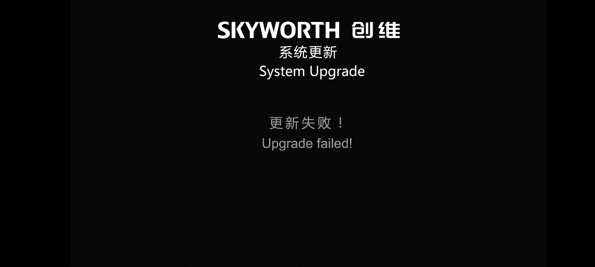
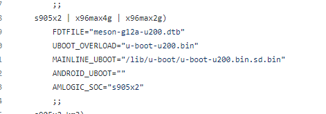
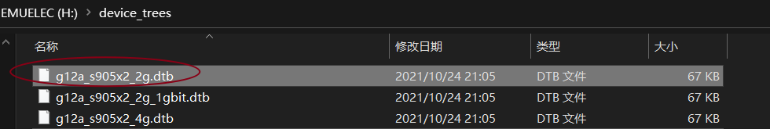
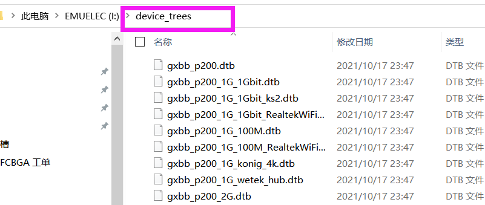
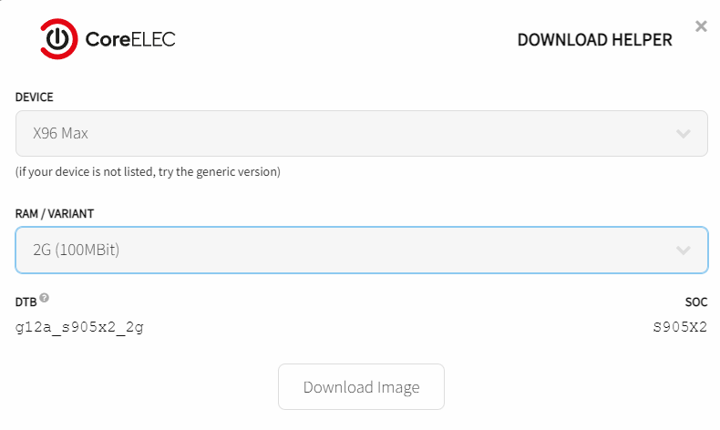

# 〇、简介与概述[https://docs.qq.com/doc/DWFprWWxZa290VXNk]

# e900v22c教程汇总 v1.0.1

# 〇、简介与概述

本文档所有人都可以查看，主要由群主（QQ群：320724049）进行维护，不定时更新。如果你有补充的，联系群主获取编辑权限，编辑方法和word相同。

跟着[Flippy大佬](https://www.right.com.cn/forum/thread-4076037-1-1.html)一起学习破解e900v22c，期待你的加入，详见更多聊天组：<https://t.me/e900v22c>，。

## 0.0 更新日志

1.  0306，v1.0
    更新ATV链接及问题，更新广东移动官固打开adb方案，加入无写入emmc的提示 by 群主

2.  0307，v1.0.1 更新adb开启方法 by 群主

## 0.1 文档简介

1.  此文档为刷机基本概念和教程的汇总，欢迎大佬们参与编写，给刚入手e900v22c的小白们拨开迷雾。

2.  文档内容来源为网络，以知识共享为初衷、尊重知识产权，侵删。

3.  本文档以及群内共享资源，仅对群内人员开放，严禁任何人将此文档转载至智能电视、开心电视、恩山等论坛或其他网站，一经发现退群+举报

## 0.2 e900v22c盒子简介

### 简要参数

| SoC            | S905L3A-B 和 S905L3A两种CPU S905L3A-B盒子底部标有Dolby Audio杜比音效标志，两种线刷救砖时有区别，卡刷无区别 |
|----------------|------------------------------------------------------------------------------------------------------------|
| CPU            | 4x Arm Cortex-A53 @ 1.80 GHz                                                                               |
| GPU            | Mali-G31 MP2 with OpenGL ES 3.2, Vulkan 1.0, and OpenCL 2.0                                                |
| Video Decoding | H.265(HEVC), VP9, AVS2 up to 4Kp75 10bit, H.264 up to 4Kp30（vp9解码被阉割）                               |
| Video Encoding | H264 *H265* up to *1080p*                                                                                  |
| RAM            | 2G DDR4（Rayson RS512M32LM4 D2BDS）                                                                        |
| ROM            | 8G eMMC5.1（SGM8000C-S27B8G）                                                                              |
| 无线蓝牙芯片   | 紫光UWE5621DS，双天线                                                                                      |
| 无线           | 2.4G、5G                                                                                                   |
| 蓝牙           | BT5.0                                                                                                      |
| 有线网络       | 10/100M                                                                                                    |
| HDMI           | 2.0                                                                                                        |

### 拆机照片

；

带杜比的e900v22c，芯片S905L3A-B

### 安卓分区表

## 0.4 FAQ

### 蓝牙和无线

在安卓/ATV下无线蓝牙正常，Linux（EmuELEC/CoreELEC/Armbian/OpenWRT）下由于dtb/uwe5621尚无编译，无法驱动蓝牙和无线网。

### 其他盒子能否通刷22c固件

见0.5小节，不是S905L3A/L3A-B主控的不能同刷，相同主控、2G/8G的就按照0.5小节试，拆开盒子，看下主控型号，一样的话不必多问，刷就完了。

## 0.5 TF卡

**推荐采购清单（测试持续进行中）：**

1.  TF 卡槽

2.  0402封装100欧**电阻**；

3.  0402封装4.7K欧**电阻**

4.  0402封装10pF**电容**

5.  聚酰亚胺高温胶带（宽度1cm以上）

6.  （热风枪使用，使用烙铁不需要）：**锡**膏（不是焊膏）、针管

你可能还需要（见2.2-TTL）：

1.  0402封装10K欧**电阻**；

2.  USB转RS232串口（TTL电平）

3.  2.54mm弯插针

4.  双母头杜邦排线

电路图参见群文件\*\*“TF-封装及电容电阻BOM清单”\*\*（老方案，不推荐，仅供参考）

### 方案1：100欧电阻和10pf电容提高兼容性（推荐，欢迎反馈结果）
。

### 0402封装热风枪焊接方法总结

1.  用聚酰亚胺高温胶带贴住内存、CPU靠近TF卡一侧的芯片底部，以及电路板上部分电容电容电阻器件，防止热风枪吹掉的锡珠进入CPU、内存下，同时防止吹掉电路板上原有元件；

2.  用烙铁马蹄头/铜编网等去掉原焊盘上的高温焊锡，然后在焊盘上涂锡膏（没有锡膏的可以先焊盘镀锡然后涂焊膏）；

3.  用镊子将0402封装的电容电阻摆放在焊盘上；

4.  热风枪中小风速、温度360\~370度吹电容电阻位置，直至焊盘锡膏/镀锡融化，0402电容电阻贴合归位；

5.  电路板静置或者使用风枪冷风降温；

6.  万用表测试是否存在短路、电阻阻值是否正常，即可插入TF卡上电测试。

### 方案2： 短接+4.7K电阻新手方案

经测试，TF卡仅需要焊接1个4.7K电阻，可以正常识别TF卡和或从TF卡启动linux系统，如图从下到上：空，空，短接，空，空，4.7k电阻

此方案简单，适合新手，用烙铁焊接，4.7K的0402电阻那里可以用0603电阻代替。

但是：这个方案存在无法从部分TF卡引导EmuELEC/Armbian等系统的缺陷。

### 盒子外壳TF开口

1.  在盒子外面贴上胶带，防止刮花；

2.  沿盒子内侧TF卡的标记，使用美工刀、电钻等工具开孔，如下图；

3.  使用美工刀修正外侧开孔，如下效果图。

### 测试过可引导的TF卡（方案1，以启动EmuELEC/CoreELEC为准）

如果将10pF电容换成30pF电容，则安卓系统下能够识别三星64G红卡，但其他三张卡无法识别，其他系统引导启动情况暂未测试。

## 0.6 类似盒子区分

与e900v22c一致有S905L3A/S905L3A-B主控芯片、无线网卡为uwe5621的盒子基本通刷，但S905L3盒子不能通刷。

**S905L3A/L3A-B和其他芯片（S905L/L3/L3B）差别大得很，12nm和28nm,
G31和Mail450，X2和X1/_的代系差别，所以不是S905L3A/L3A-B就不要尝试22c/22d的任何固件了，没结果，尽快退群或者购买22c/22d。**

### E900V22D

盒子有两种：

第一种盒子：盒子CPU与e900v22c一致，有TF卡空位，无wifi，固件可以刷22c的，armbian
elec
openwrt等固件也可以刷22c的，钱钱不够的也推荐买这一款，除了没wifi以外和22c通用。

第二种盒子：盒子CPU为S905L3，有TF卡空位，无wif，**不能通刷**，

### M401A

江苏移动 M401A（2+16）S905L3A，无wifi有蓝牙 不确定

### M411A

黑龙江移动 M411A（2+8）S905L3A

### UNT403A

移动魔百盒UNT403A有多种，无wifi、有蓝牙，无tf卡空位，带杜比盒子有为S905L3A-B芯片，不带的为S905L3A，S905L3A能否通刷待测试

### UNT413A

移动魔百盒UNT413A，无TF卡槽，无线uwe5621，盒子有两种S905L3A芯片的和S905L3芯片的，S905L3A能否通刷待测试

### B863av3.2-M

中兴B863av3.2-M 无TF空位 分是否带杜比，不带杜比 S905L3A

### 假装有台22c/22d

非22c/22d盒子且通过拆机确认CPU为S905L 3A/CPU为S905L
3A-B，如果已有原机救砖方案，或者胆子大，可以逐个尝试线刷群文件救砖固件，然后你就可以快乐地卡刷所有的22c、22d的官改和原生atv固件了。

# 线刷、卡刷、USB/TF烧录

※
如果你是运营商系统，并且怕刷机后变砖，建议先使用Armbian的ddbr备份全盘eMMC，方便退回运营商系统或者救砖。参考armbian和全盘备份部分。

## 1.1卡刷(使用U盘或者TF卡)

卡刷包一般是指代ota格式的更新包，它需要拥有差分更新的能力(在某些场合，卡刷包只包含新旧文件的差别以节省空间。如果不使用这个特性，ota格式的包也可以接近成为完整的刷机包)，因此需要一个能操作单个文件的平台上才能执行，这个平台就是recovery。

### e900v22c进入卡刷步骤：

1.  固件准备：将U盘格式化为FAT32格式，解压缩刷机包中所有文件到U盘根目录，主要包括三个文件

    1.  factory_update_param.aml

    2.  recovery.img

    3.  update.zip

2.  将U盘插到靠近电源开关的USB口

3.  进入卡刷的几种方法：

    1.  关闭盒子电源，打开盒子电源后，以每秒三次的频率按遥控器的向右方向键，直至屏幕显示开始更新；

    2.  在第三方系统上，插入U盘，屏幕显示本地升级
        D:/update.zip，遥控选择该文件后点确认，即进入卡刷模式；

4.  命令法：通过TTL或adb命令（可能需要root）发送指令：

### 卡刷错误处理

原因：

1.  检查根目录下factory_update_param.aml、recovery.img、update.zip三个文件的完整性；

2.  重新更换优盘，使用DiskGenius将全盘格式化为FAT32格式，注意全盘只保留一个分区；

## 1.2 线刷（使用双公头USB线）

线刷包一般是分区镜像，一般需要在下载模式，直接访问闪存，需要使用主控芯片公司提供的下载软件如Amlogic的USB_Burning_Tool。下载模式状态下闪存上的内容都可以改动，甚至包括软件层的bootloader，比方说安卓的通用下载模式fastboot。当然下载模式不止fastboot，设备在出厂时会有更低级的下载模式，新出厂的闪存里什么都没有，所以芯片组必须要有向完全空白的闪存写入数据的能力。

### e900v22c进入线刷的几种方法（线刷一般用来救砖，会丢三码，无法换回原版运营商系统，小白勿尝试）：

1.  上电法：关闭盒子电源开关，使用双公USB线接入靠近电源开关的USB口（盒子亮红灯），刷机软件选择好固件，先不勾选擦除，点开始刷机，打开电源开关后进入线刷；

2.  短接法：系统变砖后无法上电进入线刷，在电路板XM01下方呈45度夹角有一个0欧姆电阻（0402）和空焊位置，空焊位置左侧为0欧电阻、右侧为地线，短接空焊位置的两个焊点即可进入等待线刷模式；

3.  命令法：通过TTL或adb命令（可能需要root）发送指令：

**※※※
注意，线刷时不了解的话先不要勾选USB_Burning_Tool右侧的各类清除选项，清除后会丢失三码**

### 线刷错误处理

原因：

1.  为选择合适固件，注意3A和3A-B区别，两者线刷固件不能混用；

2.  双公头USB线问题，更换带磁珠、线长较短双公头USB线；电脑有type-c口的话，用手机数据线，反过来用。

3.  USB口问题，使用主板上的USB输出，不要使用USB-HUB，推荐USB 2.0口；

4.  烧写固件软件版本问题，彻底拆卸原有版本Amlogic-USB_Burning_Tool，使用最新版，Amlogic-USB_Burning_Tool_v3.1.0（群文件中有），安装后为加载固件，会自动跳转到2.1.8版本；或者使用2.2.4以上版本；

5.  电脑系统不兼容，推荐更换win7电脑尝试。

## 1.3 USB/TF烧录

安装Armbian、EmuELEC、CoreELEC等固件需要将系统烧录进USB/TF卡，可以使用**Rufus**等移动设备烧录工具写入，写入后一般需要替换dtb文件，需要使用**DiskGenius**硬盘工具替换。上述软件在群文件中都可以搜索得到。

# 二、adb与TTL

## 2.1 adb简介与常用工具

adb,全称 Android Debug
Bridge（安卓调试桥）。它就是一个命令行调试工具，用于通过电脑端与模拟器或者是设备之间的交互。在打开系统的adb以后，通过有线/无线网络的
**IP:端口**
连接至盒子，可以运行命令行对盒子进行分区备份、恢复、软件安装、拆卸、开机动画替换、等操作，固件的常用端口有：5555/60001/8287。

### 常用的adb集成调试工具：

**PC端：**

开心电视网网站长@剑心制作的
**开心电视助手**，本群共享文件已上传，最新为4.0测试版。

**手机端：**

甲壳虫ADB/Remotea ADB Shell

### 运营商e900v22c固件（广东移动爱家TV版本）的adb开启方法：

开启adb和root共4步，按步骤来，看仔细，每一步、每个按键都不能少。

运营商e900v22c固件（广东移动爱家TV版本）全国全网通用，能看咪咕高清电影和iptv（仅回放，没直播），前提是盒子绑定的手机号没有停机。

1.  按遥控器菜单键10次，再按向右方向键1次；按下遥控器菜单键10次，再按向下方向键1次，界面显示open；

2.  通过adb客户端连接盒子adb默认端口为60001，连接两次，两次连接都会显示失败，不用管它；

3.  按遥控器菜单键10次，再按向右方向键1次；按下遥控器菜单键10次，再按向下方向键1次，界面显示open；

4.  使用adb客户端连接adb默认端口为60001，默认开启adb未ROOT，使用开心电视助手中的“ADB
    ROOT”获取adb的ROOT权限，期间助手会重启一次，若开心电视助手未自动重启，手动重新启动开心电视助手。

    ※ 感谢@⌒【快乐】⌒i

**更新开启TELNET的方法**

1.  按下遥控器菜单键10次，再按向下方向键1次，界面显示open；

2.  用telnet登录 IP:3000 root （盒子IP地址，端口号：3000 ，用户名：root
    ,密码：空）即可使用telnet登录。

3.  TELNET用法和ADB大致相同，区别是直接具有ROOT权限，所有的命令不再需要adb shell
    这种前缀。例如安装U盘下的APP，只需要CD进U盘相应目录，pm install XXX.apk
    即可进行安装 。

## 2.2 TTL简介与常用工具

### TTL转接、插针制作

TTL一般指的是USB转TTL电平的RS232串口设备，通过串口发送指令代码给盒子和接收指令输出，可以查看盒子启动过程中的日志、输入命令、中断uboot的autoboot等。一般需要三个引脚GND、TX、RX，但盒子一般还包含一个3.3V的供电引脚，用于给CPU和eMMC供电，接线时一般不接电源引脚，防止误差5V电源烧坏CPU，或者引入电平干扰。

22c的串口工作波特率为115200，引脚需要自行制作接插件，推荐选用2.54mm间距弯插针制作，如下图，注意针脚弯折方向。使用弯针制作，插入排线后，可以从未焊接的光纤输出位置钻孔引出TTL串口线，使用弯针不影响合盖。

### RX上拉电阻

为了提高RX的抗干扰能力，防止启动过程中uboot被中断，可给RX端补焊10k的上拉电阻，焊盘空位如下图所示：

### 工具

PuTTY

# 三、备份与恢复

## 3.1 分区备份

打开adb，使用开心电视助手4.0备份。

## 3.2 ddbr全盘备份

准备一个12G以上的U盘，刷入armbian系统，输入armbian-tf扩展分区容量，在使用ddbr、b命令备份全盘。以下为ddbr记录和输出。

# 四、官改安卓第三方系统

## 4.1 官改卡刷包分享

本群共享文件内 **3-安卓固件**
文件夹内均为群内大佬制作和分享的第三方固件。你也可以访问开心电视论坛<http://www.kaixindianshi.com/和>智能电视论坛https://www.znds.com/自行寻找。

推荐卡刷安装群文件内@༺ۣۖ鑫ۣۖ༒ۣۖ爺ۣۖ༻制作的系列刷机包。

\*群内E900-S广西原版固件为9.0固件，由于E900-S9配置，主板，cpu，无线网卡等均与E900V22C相同，E900V22C可直接刷入，刷入方法为提取包内的recovery.img至u盘根目录，并将固件重命名为update.zip也一同放入u盘内（无需factory_update_param.aml分区文件），按照1.1卡刷包刷入步骤即可。

1.  E900-S有两个版本，一个为安卓9.0（系统设置显示为E900-S9）配置与E900V22C一致，一个为安卓4.4版本（系统设置显示为E900-S），其中安卓4.4的E900-S配置均与22C不同，不可使用，一定看好cpu为S905L3A或L3A-B才行。

2.  刷入广西原版固件后，无法直接线刷，晶晨刷机工具会不识别，需要正常卡刷【包内包含update.zip
    recovery.img
    factory_update_param.aml三个文件】回E900V22C的第三方固件后，即可正常线刷。

## 4.2 系统优化

### 修改开机动画

开机动画一般以修改/替换bootanimation.zip达到修改开机动画的目的，bootanimation.zip里一般包含的是数张静态图片，并由desc.txt控制，帧数（帧率），动画循环等，让图片连成流畅的动画。bootanimation.zip文件一般位于system/media/下，E900V22C支持的开机动画分辨率为1920\*1080，图片格式为png。其中群内二次元包开机动画是以BootVideo形式启动，能力有限，需要修改可自行学习。（将包内的BootVideo文件替换为bootanimation.zip可同样达到修改开机动画的效果）

如何制作自己的开机动画，可以参考https://blog.csdn.net/myvest/article/details/50856199

### 修改开机第一屏（Logo）

开机第一屏顾名思义就是开机立刻显示的图像，开机第一屏就像安卓手机开机时显示手机型号，手机品牌等第一屏信息。

通过修改/verdor/logo_files下的bootup文件达到修改开机第一屏的目的，E900V22C支持的开机第一屏分辨率为1920\*1080，图片格式为bmp。

**以上修改开机动画，开机第一屏的方式都可以通过开心电视助手/adb/TTL等方式修改。**

## 4.4 存在的问题

### 卡刷失败

解决方案：换U盘，查看文件是否正确

### 黑屏

开机可能黑屏1次，点返回键即可；或者刷@༺ۣۖ鑫ۣۖ༒ۣۖ爺ۣۖ༻最新固件，在群精华；ATV无此问题

https://blog.csdn.net/a504701039/article/details/72876298

### 语音控制

它能听懂你说话，你听不懂它说话。解决方案，退回原始运营商系统。

### 键盘不能输入q

重启先输入q，ATV无此问题

### 安卓进入KODI无法遥控

断开蓝牙遥控，使用红外遥控模式（蓝牙遥控自带红外），ATV无此问题

### 无法高清显示，显示分辨率不正常

官方固件原生问题，无法修改，ATV无此问题

# 五 原生安卓第三方系统

## 5.1 ATV(android TV)

@雪狐制作出了初代方案，已上传 https://www.znds.com/tv-1212658-1-1.html

去智能电视网顶1次，喊一声“雪狐大佬YYDS”

## 5.2 卡刷包刷机方法

大概就是update.zip放到FAT32根目录，把里面recovery.img拽出来放根目录，然后正常卡刷，卡刷前最好先开机按左键双清

## 5.3 存在的问题

### 无法登陆账号

解决方案：等更新

### 卡第二屏

上电开机遥控左键双清

### adb

设置中点击版本号？打开高级选项，在高级选项打开usb的adb，adb端口号：8287

### 语音

不能用，忘了它吧

### 遥控问题

默认不连蓝牙，在设置中连接蓝牙遥控试试

# 六、热门第三方系统刷机

先按照1.3部分烧录第三方固件到TF/SD/USB。进入TF/SD/USB的Armbian/EmuELEC/CoreELEC/OpenWRT等系统的方法与1.1卡刷方法一致，每秒3次按遥控向右键然后上电开机，不用刷机运营商自带系统也可以进入。**如果无法进入第三方系统，出现创维固件系统更新/更新失败，更换TF/USB、重新烧录后重试。**

**※不要写入eMMC，会砖不启动，除非你有完善救砖方案且为开发人员。**

## 6.1 Armbian

ophub的Armbian仓库地址
https://github.com/ophub/amlogic-s9xxx-armbian/releases，选择s905l3a的5.15内核版本，使用U盘启动

**※不要写入eMMC，会砖不启动，除非你有完善救砖方案且为开发人员。**

### 另选安装方案1：（推荐）安装@烟花定制云编译版本

群文件有编译好的文件，也可以到github仓库下载最新版，仓库地址：<https://github.com/zzcand111/amlogic-s9xxx-armbian/releases>

如果需要自己定制化编译，以下为修改参考：

需要修改amlogic-s9xxx-armbian/rebuild

此方案可以正常驱动有线网，但无线网目前由于dtb/uwe5621尚无编译，无法驱动。

### 另选安装方案2：自行修改dtb，测试用途

选择Armbian_22.02.0_Aml_s905x2的文件， 在boot分区下

1.  uEnv文件内修改为的FDT=/dtb/amlogic/meson-g12a-u200.dtb

2.  根目录下uboot-u200.bin重命名覆盖为u-boot.ext

此方案可能黑屏，或者卡有线网5分钟，如果黑屏只操作第一步，启动后等待5分钟以上，可以通过ttl线/键盘执行ddbr等命令。

### Armbian使用相关说明

#### 在 TF/SD/USB 中使用 Armbian, 激活 TF/SD/USB 的剩余空间

请登录 Armbian 系统 → 输入命令：

根据提示输入 e 将剩余空间扩容至当前系统分区和文件系统，输入c 将创建新的第 3
分区。或者手动分配剩余空间。

#### 备份/还原 EMMC 原系统

支持在 TF/SD/USB 中对盒子的 EMMC 分区进行备份/恢复。建议您在全新的盒子里安装
Armbian 系统前，先对当前盒子自带的安卓 TV
系统进行备份，以便日后在恢复电视系统等情况下使用。请从 TF/SD/USB启动 Armbian
系统 → 输入命令：

根据提示输入b 进行系统备份，输入 r 进行系统恢复。

#### 安装 Docker 服务

登录 Armbian 系统 → 输入命令：

#### 修改 Armbian 配置

登录 Armbian 系统 → 输入命令：

#### 为 Armbian 创建 swap

如果你在使用 docker 等内存占用较大的应用时，觉得当前盒子的内存不够使用，可以创建
swap
虚拟内存分区，将磁盘空间的一定容量虚拟成内存来使用。下面命令输入参数的单位是
GB，默认为 1。

登录 Armbian 系统 → 输入命令：

## Armbian参考

<https://zhuanlan.zhihu.com/p/461442176>

<https://post.smzdm.com/p/awk8mpq4/>

编辑extlinux\\extlinux.conf、boot.ini、uEnv.ini文件

## 6.2 EmuELEC

使用s905x2-s905x3的镜像，dtb文件选择第一个**g12a_s905x2_2g，的dtb文件，或者gxbb_p200.dtb**，或者\*\*gxbb_p200_2G_100M.dtb，\*\*改名字成
“**dtb.img**”，放置在EmuELEC分区根目录下。

进入TF/SD/USB的Armbian/EmuELEC/CoreELEC/OpenWRT等系统的方法与1.1卡刷方法一致，每秒3次按遥控向右键然后上电开机，不用刷机运营商自带系统也可以进入，如果无法进入，更换TF/SD/USB重新烧录后重试。

emuelec基础知识，一共二十三个章节，转自ZNDS论坛，玩游戏系统前建议学习下基础知识

<https://www.znds.com/forum.php?mod=viewthread&tid=1171734&fromuid=19486>

<https://zhangguanzhang.github.io/2022/01/22/EmuELEC/>

### 游戏退出

select+两次start试试，退出游戏是热建+两次start一般设置在select上，或者同时按下l3+r3里面也可以退出游戏

## 6.3 CoreELEC

### 方案1 自行下载最新版本

官网https://coreelec.org/，下载X96
Max的固件，注意不是Plus。安装方法与EmuELEC类似。

进入TF/SD/USB的Armbian/EmuELEC/CoreELEC/OpenWRT等系统的方法与1.1卡刷方法一致，每秒3次按遥控向右键然后上电开机，不用刷机运营商自带系统也可以进入，如果无法进入，更换TF/USB重新烧录后重试。

### 方案2 群文件

群文件有加入修改了dtb后的19.4版本，可以直接烧录进USB/TF中。

## 6.4 OpenWRT

仓库地址：https://github.com/ophub/amlogic-s9xxx-armbian，安装使用与armbian类似

@烟花修改版群文件有，仓库地址
<https://github.com/zzcand111/amlogic-s9xxx-openwrt/releases>

**※不要写入eMMC，会砖不启动，除非你有完善救砖方案且为开发人员。**

# 七、救砖

群文件中下载救砖包，注意芯片3A与3A-B区别，使用晶晨芯片烧录工具工具，载入img固件，点击开始，按照1.2中方法进入线刷。

## 7.1 正常线刷及TTL输出
## 7.2 线刷后恢复skmac分区（未测试通过）

线刷后可能覆盖mac分区，导致冲掉系统的sn/mac/stb id三码，需要恢复mac分区：

1.  将分区备份文件skmac.img、拷贝至U盘的backup文件夹下，插到盒子上；

2.  查看U盘的编号，使用ls /storage命令，其中94D8-B9EA为U盘编号

3.  恢复

## 7.3 线刷后ddbr全盘恢复

线刷救砖及恢复分区后，仍然无法通过ott的mac鉴权，后通过armbian的ddbr全盘恢复后可以通过鉴权使用IPTV。

## 7.4 砖机的TTL输出：

无法进系统，TTL提示：

# 讨论组
QQ群: 320724049

TG群: https://t.me/e900v22c
