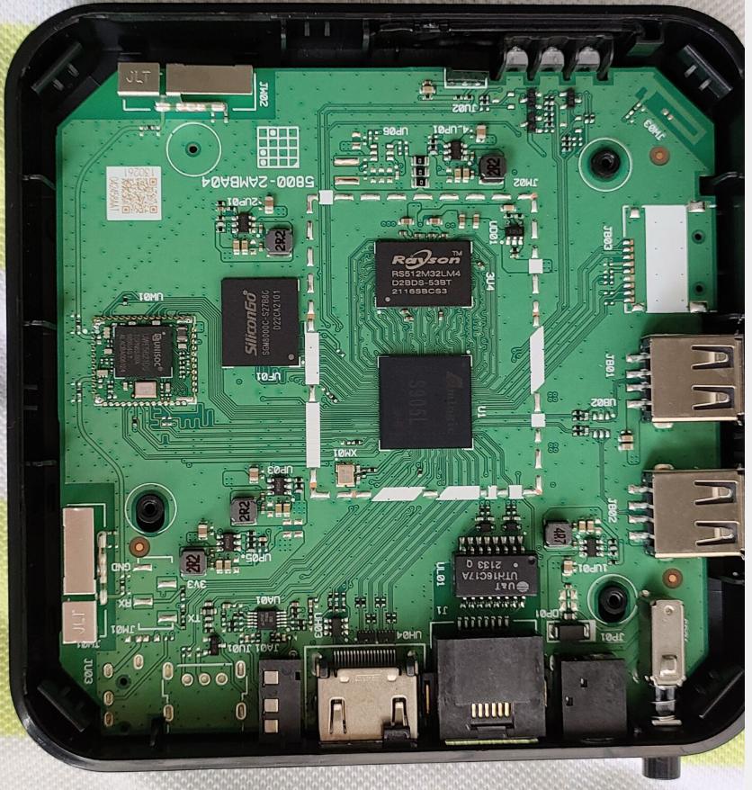
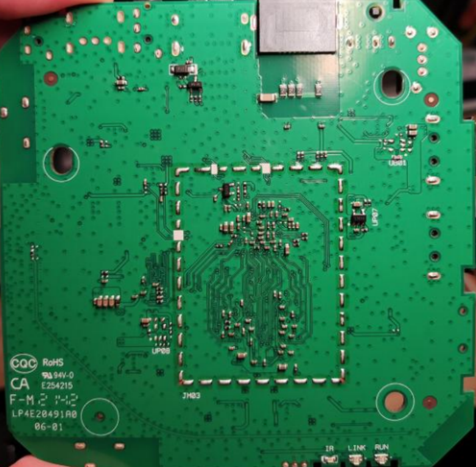
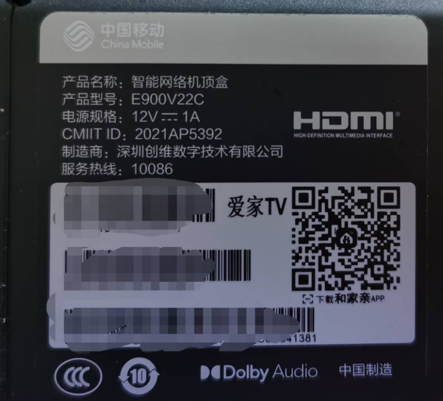
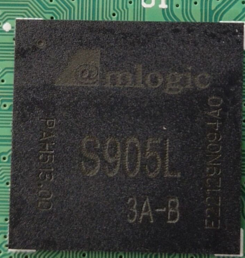
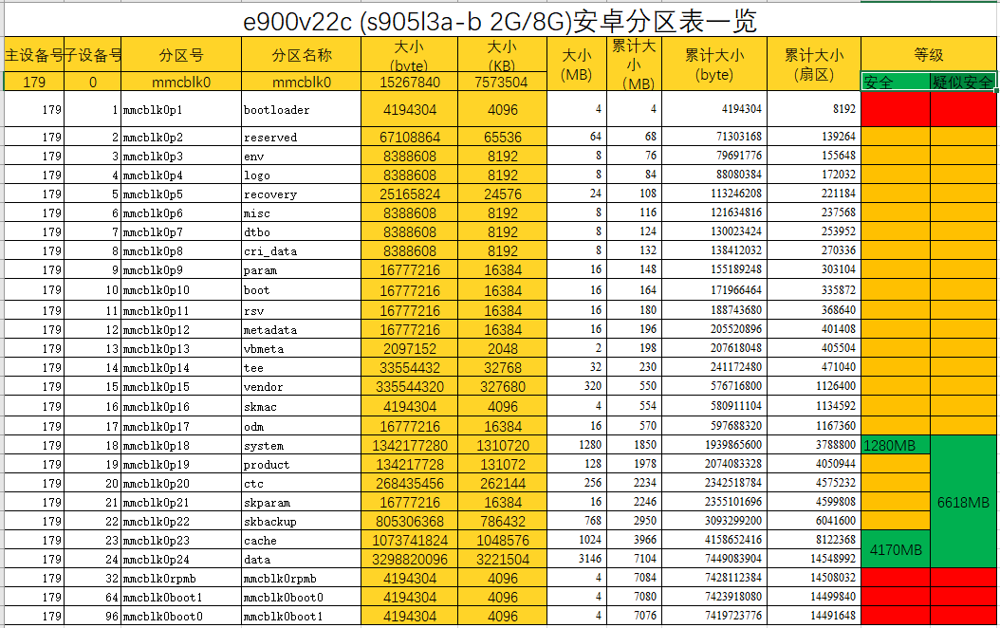

# e900v22c项目与讨论组文档

### 讨论组

QQ群: [320724049](https://jq.qq.com/?_wv=1027&k=cP3AWZeI)

TG群: <https://t.me/e900v22c>

# 〇、简介与概述

本文档 <https://docs.qq.com/doc/DWFprWWxZa290VXNk> 所有人都可以查看，主要由群主（QQ群：320724049）进行维护，不定时更新。如果你有补充的，联系群主获取编辑权限，编辑方法和word相同。

跟着[Flippy大佬](https://www.right.com.cn/forum/thread-4076037-1-1.html) 一起学习破解e900v22c，期待你的加入，详见：<https://t.me/e900v22c>。

相关项目：

<https://github.com/ophub/amlogic-s9xxx-armbian>

<https://github.com/ophub/amlogic-s9xxx-openwrt>

<https://github.com/unifreq/openwrt_packit>

## 0.0 更新日志

1.  0307，v1.0.1 更新adb开启方法 by 群主

2.  0306，v1.0 更新ATV链接及问题，更新广东移动官固打开adb方案，加入无写入emmc的提示 by 群主

## 0.1 文档简介

1.  此文档为刷机基本概念和教程的汇总，欢迎大佬们参与编写，给刚入手e900v22c的小白们拨开迷雾。

2.  文档内容来源为网络，以知识共享为初衷、尊重知识产权，侵删。

3.  本文档以及群内共享资源，仅对群内人员开放，严禁任何人将此文档转载至智能电视、开心电视、恩山等论坛或其他网站！

## 0.2 e900v22c盒子简介

### 简要参数

|      项目      |                                                 详情                                                       |
|----------------|------------------------------------------------------------------------------------------------------------|
| SoC            | S905L3A-B 和 S905L3A两种CPU S905L3A-B盒子底部标有Dolby Audio杜比音效标志，两种线刷救砖时有区别，卡刷无区别 |
| CPU            | 4x Arm Cortex-A53 @ 1.80 GHz                                                                               |
| GPU            | Mali-G31 MP2 with OpenGL ES 3.2, Vulkan 1.0, and OpenCL 2.0                                                |
| Video Decoding | H.265(HEVC), ~~VP9~~, AVS2 up to 4Kp75 10bit, H.264 up to 4Kp30（VP9解码被阉割）                           |
| Video Encoding | H264 *H265* up to *1080p*                                                                                  |
| RAM            | 2G DDR4（Rayson RS512M32LM4 D2BDS）                                                                        |
| ROM            | 8G eMMC5.1（SGM8000C-S27B8G）                                                                              |
| 无线蓝牙芯片   | 紫光UWE5621DS，双天线                                                                                      |
| 无线           | 2.4G、5G                                                                                                   |
| 蓝牙           | BT5.0                                                                                                      |
| 有线网络       | 10/100M                                                                                                    |
| HDMI           | 2.0                                                                                                        |
### 拆机照片

；

带杜比的e900v22c，芯片S905L3A-B

### 安卓分区表

# 以下内容详见 

[在线文档](https://docs.qq.com/doc/DWFprWWxZa290VXNk)

QQ群: [320724049](https://jq.qq.com/?_wv=1027&k=cP3AWZeI)

TG群: <https://t.me/e900v22c>

## 0.4 FAQ

## 0.5 TF卡加装

## 0.6 类似盒子区分

### E900V22D

### M401A

### M411A

### UNT403A

### UNT413A

### B863av3.2-M

### 假装有台22c/22d

# 线刷、卡刷、USB/TF烧录

## 1.1卡刷(使用U盘或者TF卡)

### e900v22c进入卡刷步骤：

### 卡刷错误处理

### e900v22c进入线刷的几种方法（线刷一般用来救砖，会丢三码，无法换回原版运营商系统，小白勿尝试）：

### 线刷错误处理

# 二、adb与TTL

## 2.1 adb简介与常用工具

### 常用的adb集成调试工具：

### 运营商e900v22c固件（广东移动爱家TV版本）的adb开启方法：

## 2.2 TTL简介与常用工具

### TTL转接、插针制作

### RX上拉电阻

# 三、备份与恢复

## 3.1 分区备份

## 3.2 ddbr全盘备份

# 四、官改安卓第三方系统

## 4.1 官改卡刷包分享

## 4.2 系统优化

### 修改开机动画

### 修改开机第一屏（Logo）

## 4.4 存在的问题

### 卡刷失败

### 黑屏

# 五 原生安卓第三方系统

## 5.1 ATV(android TV)

## 5.2 卡刷包刷机方法

## 5.3 存在的问题

### 无法登陆账号

# 六、热门第三方系统刷机

## 6.1 Armbian

## 6.2 EmuELEC

## 6.3 CoreELEC

## 6.4 OpenWRT

# 七、救砖

